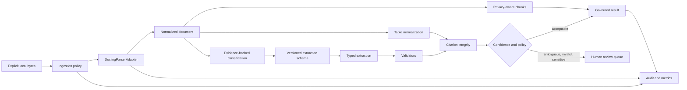

# DocuTrace architecture

DocuTrace is a governed orchestration layer inside the Docling package. It keeps
Docling's format backends and document model as the parsing foundation and adds
policy before and after conversion.

## Stable contracts

`models.py` defines typed jobs, assets, revisions, normalized elements and
tables, schemas, fields, citations, chunks, audit events, metrics, and
provenance. Serialization is deterministic and fingerprints use SHA-256.

`ParserAdapter` decouples governance from parser implementation. The production
adapter passes only an in-memory `DocumentStream` into the inherited
`DocumentConverter`. The `fast` PDF profile selects the inherited model-free
native PDF pipeline. Other PDF profiles require an explicit local model-artifact
directory before the converter is imported. `DeterministicFixtureParser` accepts only explicitly marked
synthetic fixtures and exists for offline evaluation; it is not a production
PDF parser.

`ExtractionProvider` similarly separates extraction policy from implementation.
The shipped deterministic provider performs local alias-based extraction.
`ExternalExtractionProvider` is an intentionally incomplete, disabled boundary:
an operator must implement an adapter, explicitly enable it, minimize context,
and address the privacy and security requirements before use.

## Lifecycle and retry semantics

Jobs move through validating, parsing, classifying, extracting, output
validation, and either completed, review-required, or failed states. The cache
key covers input fingerprint, profile, schema, parser, and provider. Repeating
the same request returns the same in-process result. Only exceptions explicitly
typed `RetryableProcessingFailure` are retried, and configuration permits zero
to three retries. Policy rejections and unknown schemas are non-retryable.

## Confidence and review

Confidence is a governed state, not a calibrated probability. Missing evidence
is `unverified`; failed validation is `low`; deterministic evidence that passes
validation may become `high`. Low/unverified, invalid/missing, schema-mandated,
or sensitive fields are routed to review. Accepted, corrected, and rejected
decisions preserve the original extracted value and reason.

## RAG boundary

Chunks contain text, page range, section path, source element IDs, content type,
size, sensitivity, and citation anchors. A small `ChunkSink` protocol permits an
operator-owned vector store without coupling DocuTrace to one vendor. Sensitive
chunks are excluded by default.
